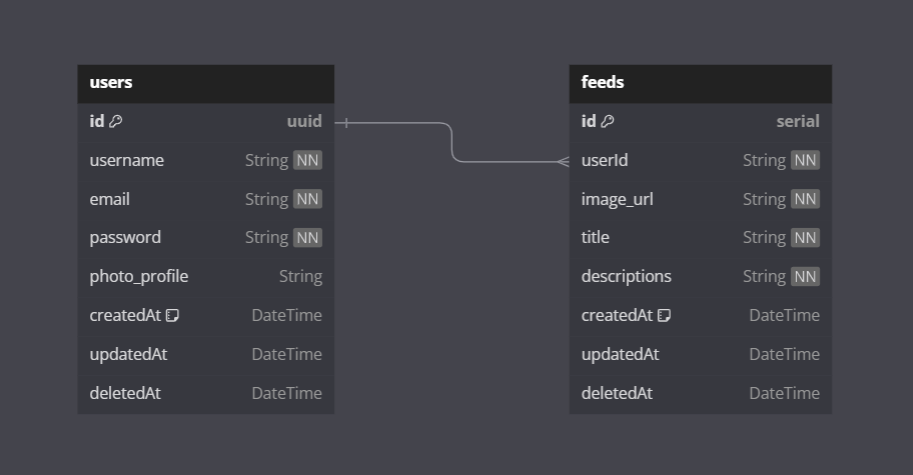

## Project Setup

Clone the project from GitHub repository:

      git clone https://github.com/fajarutamaa/backend-challenge-6.git

Change Directory:

      cd backend-challenge-6

Install all package dependencies:

      npm install

Compile and hot-reload for development:

      npm run dev

## Entity-Relationship Diagram (ERD)

This repository includes the Entity-Relationship Diagram (ERD) illustrating the relationships and structure of our project's database. Below is an example of the ERD for a visual representation of the database schema.

## Error Handling

| Status Code | Meaning              | Error Message                     |
|-------------|----------------------|-----------------------------------|
| 200         | OK                   | Request successful                |
| 400         | Bad Request          | Invalid request                   |
| 401         | Unauthorized         | Authentication failed             |
| 404         | Not Found            | Data not found                    |
| 500         | Internal Server Error| Internal server error             |

## Support and Contribution

If you encounter issues or have questions, please open [Issues](https://github.com/fajarutamaa/backend-challenge-6/issues).

We also welcome contributions!

## License

For more information, see the [MIT LICENSE](https://github.com/fajarutamaa/backend-challenge-6/blob/main/LICENSE)
